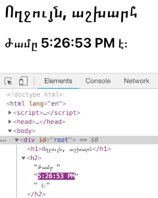

Էլեմենտները React հավելվածի փոքրագույն կառուցողական բլոկերն են։

Էլեմենտը նկարագրում է այն\` ինչ ցանկանում եք տեսնել էկրանին։

```js
const element = <h1>Ողջույն, աշխարհ</h1>;
```

Ի տարբերություն զննարկիչի DOM էլեմենտների\` React էլեմենտները իրենցից ներկայացնում են հասարակ օբյեկտներ և ռեսուրսատար չեն ստեղծման համար։ React DOM-ը համեմատելով էլեմենտները հոգ կտանի DOM-ը թարմացնելու համար։

>**Նշում.**
>
>Հնարավոր է շփոթել էլեմենտները մեկ այլ, ավելի հայտնի հասկացության\` կոմպոնենտի հետ։ Մենք կներկայացնենք կոմպոնենտները [հաջորդ բաժնում](/docs/components-and-props.html)։ Կոմպոնենտները կազմված են էլեմենտներից. այդ իսկ պատճառով, մինչ առաջ անցնելը, խորհուրդ ենք տալիս կարդալ այս բաժինը։

## Էլեմենտնի արտապատկերումը DOM-ում {#rendering-an-element-into-the-dom}

Ենթադրենք HTML ֆայլում որևէ տեղ ունենք հետևյալ `<div>` էլեմենտը։

```html
<div id="root"></div>
```

Մենք այն անվանում ենք «root» DOM հանգույց, որովհետև ամեն ինչը նրա ներսում ղեկավարվելու է React DOM-ի կողմից.

Սովորաբար React-ով ստեղծված հավելվածները ունեն մեկ արմատ (root) DOM հանգույց։ եթե դուք ինտեգրում եք React-ը արդեն գույություն ունեցող հավելվածին, ապա կարող եք ունենալ այնքան «root» DOM հանգույցներ որքան որ կցանկանաք։

<<<<<<< HEAD

React էլեմենտը արմատ DOM հանգույցում նկարելու համար, պետք է երկուսն էլ փոխանցել `ReactDOM.render()`-ին։
=======
To render a React element into a root DOM node, pass both to [`ReactDOM.render()`](/docs/react-dom.html#render):
>>>>>>> 32e3c7a6f92cb6580eb38c047960805d5998c2ec

`embed:rendering-elements/render-an-element.js`

[Փորձել CodePen-ում](codepen://rendering-elements/render-an-element)

Այն էջում ցույց կտա «Ողջույն, աշխարհ»

## Թարմացնում ենք նկարված էլեմենտը {#updating-the-rendered-element}

React էլեմենտները [անփոփոխ են](https://en.wikipedia.org/wiki/Immutable_object)։ Էլեմենտի ստեղծման պահից հետո դուք չեք կարող փոխել նրա ատրիբուտները կամ զավակներին։ Էլելեմենտը նման է ֆիլմի մեկ կադրին\` այն ներկայացնում է UI-ը ժամանակի որոշակի պահին։

<<<<<<< HEAD
Այս պահի մեր գիտելիքներով UI-ը թարմացնելու միակ ձևը նոր էլեմենտ ստեղծելն ու փոխանցելն է `ReactDOM.render()`-ին։
=======
With our knowledge so far, the only way to update the UI is to create a new element, and pass it to [`ReactDOM.render()`](/docs/react-dom.html#render).
>>>>>>> 32e3c7a6f92cb6580eb38c047960805d5998c2ec

Դիտարկեք այս ժամացույցի օրինակը.

`embed:rendering-elements/update-rendered-element.js`

[Փորձել CodePen-ում](codepen://rendering-elements/update-rendered-element)

<<<<<<< HEAD
Այն կանչում է `ReactDOM.render()`-ը [`setInterval()`](https://developer.mozilla.org/en-US/docs/Web/API/WindowTimers/setInterval)-ի հետկանչ ֆունկցիայից\` յուրաքանչյուր վարկյանը մեկ։
=======
It calls [`ReactDOM.render()`](/docs/react-dom.html#render) every second from a [`setInterval()`](https://developer.mozilla.org/en-US/docs/Web/API/WindowTimers/setInterval) callback.
>>>>>>> 32e3c7a6f92cb6580eb38c047960805d5998c2ec

>**Նշում.**
>
<<<<<<< HEAD
>Գործնականում, React հավելվածների մեծամասնությունը `ReactDOM.render()`-ը կանչում է մեկ անգամ։ Հաջորդ բաժիններում մենք կսովորենք թե ինչպես է նմանատիպ կոդը ինկապսուլացվում [վիճակով կոմպոնենտ](/docs/state-and-lifecycle.html)-ներով։
=======
>In practice, most React apps only call [`ReactDOM.render()`](/docs/react-dom.html#render) once. In the next sections we will learn how such code gets encapsulated into [stateful components](/docs/state-and-lifecycle.html).
>>>>>>> 32e3c7a6f92cb6580eb38c047960805d5998c2ec
>
>Խորհուրդ ենք տալիս բաց չթողնել թեմաները, քանի որ նրանք հիմնված են մեկը մյուսի վրա։

## React-ը թարմացնում է միայն այն ինչը անհրաժեշտ է {#react-only-updates-whats-necessary}

React DOM-ը համեմատում է էլեմենտը և նրա զավակներին նախորդների հետ, և կիրառում է DOM-ի թարմացում միայն անհրաժեշտության դեպքում\` DOM-ը ցանկալի վիճակին հասցնելու համար։

Դուք կարող եք համոզվել ստուգելով [նախորդ օրինակը](codepen://rendering-elements/update-rendered-element) զննարկիչի գործիքների օգնությամբ:



<<<<<<< HEAD
Չնայած նրան որ մեր ստեղծած էլեմենտը նկարագրում է ողջ UI ծառը յուրաքանչյուր tick-ի ժամանակ, React DOM-ը թարմացնում է միայն այն տեքստային հանգույցը, որի կոնտենտը ենթարկվել է փոփոխության։

Փորձը ցույց է տալիս, որ մտածելը թե ինչ տեսք պետք է ունենա UI-ը յուրաքանչյուր պահին` վերացնում է սխալների մի ամբողջ դաս, քան մտածելը թե ինչպես փոխել UI-ը ժամանակի ընթացքում։
=======
Even though we create an element describing the whole UI tree on every tick, only the text node whose contents have changed gets updated by React DOM.

In our experience, thinking about how the UI should look at any given moment, rather than how to change it over time, eliminates a whole class of bugs.
>>>>>>> 32e3c7a6f92cb6580eb38c047960805d5998c2ec
